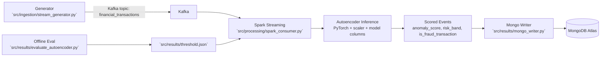

# Fraud Detection Engine

Real-time fraud detection pipeline using Kafka, Spark Structured Streaming, and a PyTorch Autoencoder.

## What This Project Does
- Generates synthetic transaction data with balance-consistent transaction types (`CASH_IN`, `CASH_OUT`).
- Trains an Autoencoder on normal transactions.
- Scores live Kafka stream events with reconstruction loss (`anomaly_score`).
- Flags only high-risk events as fraud and writes scored records to MongoDB Atlas.

## Architecture


## Repository Structure
- `src/ingestion/transaction_logic.py`: Shared synthetic transaction logic used by both dataset and live stream generation.
- `src/ingestion/generate_dataset.py`: Regenerates `training_data.csv` at project root.
- `src/ingestion/stream_generator.py`: Kafka producer for live synthetic transactions.
- `src/processing/preprocessed.py`: Training preprocessing + scaler/column artifact generation.
- `src/training/best_model.py`: Retrains the production autoencoder and saves model config.
- `src/processing/spark_consumer.py`: Kafka consumer + Spark scoring stream.
- `src/results/evaluate_autoencoder.py`: Holdout metrics + threshold artifacts.
- `src/results/mongo_writer.py`: Writes scored stream to MongoDB.

## Data Logic Fix (Important)
`type` is now tied to balance transitions:
- `CASH_OUT`: `newBalanceOrg = oldBalanceOrg - amount`, `newBalanceDest = oldBalanceDest + amount`
- `CASH_IN`: `newBalanceOrg = oldBalanceOrg + amount`, `newBalanceDest = oldBalanceDest - amount`

This removes the earlier mismatch where transaction type was random but balances were not type-aware.

## Setup
1. Activate env and install dependencies:
```cmd
conda activate FDE_env
pip install -r "D:\Fraud Detection Engine\requirements.txt"
```
2. Ensure Java 17 and Hadoop/winutils are configured in the current terminal.
3. Start Kafka using `docker-compose.yml`.

## Full Rebuild Workflow
Run in this order after changing data logic:

1. Regenerate dataset:
```cmd
conda run -n FDE_env python "D:\Fraud Detection Engine\src\ingestion\generate_dataset.py"
```

2. Retrain model + regenerate scaler/feature artifacts:
```cmd
conda run -n FDE_env python "D:\Fraud Detection Engine\src\training\best_model.py"
```

3. Recompute evaluation and threshold artifacts:
```cmd
conda run -n FDE_env python "D:\Fraud Detection Engine\src\results\evaluate_autoencoder.py"
```

4. Start streaming writer (Spark + Mongo sink):
```cmd
conda run -n FDE_env python "D:\Fraud Detection Engine\src\results\mongo_writer.py"
```

5. In another terminal, start producer:
```cmd
conda run -n FDE_env python "D:\Fraud Detection Engine\src\ingestion\stream_generator.py"
```

## Streaming Decision Logic
- Base threshold is read from `src/results/threshold.json` (`selected_threshold`).
- `risk_band`:
  - `low`: score below threshold
  - `medium`: score between threshold and `1.5 * threshold`
  - `high`: score above `1.5 * threshold`
- Fraud flag:
  - `is_fraud_transaction = 1` only for `high` risk.

## Notes
- `.env` should contain Mongo URI as key `uri`.
- `training_data.csv`, `models/`, and `.csv` outputs are git-ignored on purpose.
- Current focus is data + ML + streaming pipeline; frontend can be added later.
