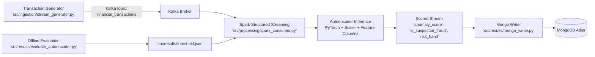

# Fraud Detection Engine

Real-time fraud detection pipeline using Kafka, Spark Structured Streaming, and a PyTorch Autoencoder.

## What This Project Does
- Streams synthetic global financial transactions into Kafka.
- Scores each transaction with an Autoencoder reconstruction loss.
- Flags high-loss transactions as suspected fraud using a threshold artifact.
- Writes scored stream records to MongoDB Atlas.

## Architecture


## Repository Structure
- `src/ingestion/generate_dataset.py`: Generates `training_data.csv` with labels and data-quality noise.
- `src/ingestion/stream_generator.py`: Kafka producer for live synthetic transaction stream.
- `src/processing/spark_consumer.py`: Kafka consumer + Autoencoder scoring stream.
- `src/results/mongo_writer.py`: Writes scored stream to MongoDB.
- `src/results/evaluate_autoencoder.py`: Builds evaluation artifacts and threshold.
- `src/utils/artifacts.py`: Regenerates model artifacts (`std_scaler.bin`, `model_columns.bin`, model structure).

## Data and Model
- Dataset: `training_data.csv` (synthetic transactions with `is_anomaly` label).
- Model type: Autoencoder trained on normal behavior.
- Fraud signal: Higher reconstruction error (`anomaly_score`) indicates out-of-pattern behavior.

## Evaluation Artifacts
Run:
```cmd
conda run -n FDE_env python "D:\Fraud Detection Engine\src\results\evaluate_autoencoder.py"
```

This writes to `src/results/`:
- `threshold.json`: recall-constrained threshold (target recall = 0.95).
- `metrics.json`: precision, recall, F1, accuracy, PR-AUC, ROC-AUC, confusion matrix.
- `threshold_sweep.csv`: threshold vs precision/recall/F1 table.
- `scored_holdout.csv`: holdout rows with score and predicted label.
- `metrics_summary.md`: readable metrics summary.

## Streaming Decision Logic
In stream inference (`src/processing/spark_consumer.py`):
- `is_suspected_fraud = anomaly_score >= selected_threshold`
- `risk_band`:
  - `low` if below threshold
  - `medium` if between `threshold` and `1.5 * threshold`
  - `high` if above `1.5 * threshold`

If `threshold.json` is missing, a safe fallback threshold is used.

## Setup
1. Activate env and install dependencies:
```cmd
conda activate FDE_env
pip install -r "D:\Fraud Detection Engine\requirements.txt"
```
2. Ensure Java 17 + Hadoop/winutils are configured in your session.
3. Ensure Kafka is running from `docker-compose.yml`.

## Run Pipeline
Terminal 1 (consumer + scoring + Mongo sink):
```cmd
conda run -n FDE_env python "D:\Fraud Detection Engine\src\results\mongo_writer.py"
```

Terminal 2 (producer):
```cmd
conda run -n FDE_env python "D:\Fraud Detection Engine\src\ingestion\stream_generator.py"
```

## Notes
- `.env` should contain Mongo URI as key `uri`.
- `training_data.csv` is synthetic and can be regenerated.
- This project currently prioritizes backend/data-science pipeline over frontend.
